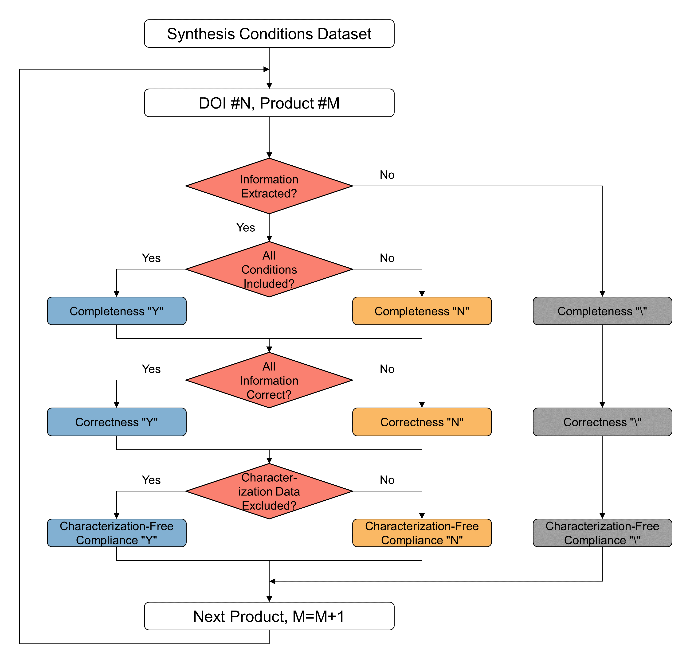

## Citation

For more information about the datasets, please refer to 
  Comparison of LLMs in Extracting Synthesis Conditions and Generating Q&A Datasets for Metal-Organic Frameworks
  Yuang Shi, Nakul Rampal, Chengbin Zhao, Christian Borgs, Jennifer T. Chayes, Omar M. Yaghi*
  https://chemrxiv.org/engage/chemrxiv/article-details/67651f5a81d2151a02580020

## Evaluation

For synthesis condition dataset evaluation, we followed the procedures below:

For Q&A dataset evaluation, please refer to 
  https://github.com/nakulrampal/RetChemQA

## Acknowledgement
This work is funded by 
  King Abdulaziz City for Science and Technology
  Bakar Institute of Digital Materials for the Planet

## License 

The dataset is distributed under the MIT open source license (see [`LICENSE.txt`](LICENSE.txt))
